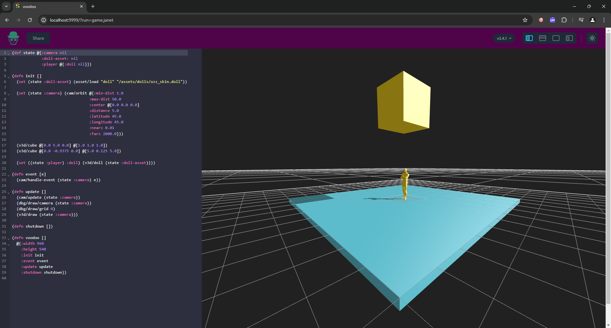

# voodoo


voodoo is a 3D game programming library written in C.

voodoo exposes an API that is intended to be invoked via scripts written in [Janet](https://janet-lang.org/).

voodoo is presently focused on creating games for the browser. Support for more platforms is planned.

voodoo is very much WIP.

## Screenshot reflecting current state of renderer



## Video demonstration
[assets/scripts/game.janet](https://github.com/zacharycarter/voodoo/assets/1181513/b061174c-ac01-4f5e-84a0-370eb4942dc0)


## [Example Usage](https://github.com/zacharycarter/voodoo/blob/master/assets/scripts/game.janet)

```janet
(def actions {:up 0
              :down 1
              :left 2
              :right 3
              :num 4})

(def bindings @{(actions :up) [input/key/up input/gamepad/dpad/up]
                (actions :down) [input/key/down input/gamepad/dpad/down]
                (actions :left) [input/key/left input/gamepad/dpad/left]
                (actions :right) [input/key/right input/gamepad/dpad/right]})

(def state @{:camera nil
             :doll-asset: nil
             :player @{:doll nil}})

(defn init []
  (set (state :doll-asset) (asset/load "doll" "/assets/dolls/ozz_skin.doll"))
  (set (state :camera) (cam/orbit @{:min-dist 1.0
                                  :max-dist 50.0
                                  :center @[0.0 0.0 0.0]
                                  :distance 5.0
                                  :latitude 45.0
                                  :longitude 45.0
                                  :nearz 0.01
                                  :farz 2000.0}))

  (v3d/cube @[0.0 5.0 0.0] @[1.0 1.0 1.0])
  (v3d/cube @[0.0 -0.9375 0.0] @[5.0 0.125 5.0])
  (set ((state :player) :doll) (v3d/doll (state :doll-asset)))
  (loop [[action binding] :pairs bindings]
    (if (not= (get binding 0) input/invalid) (input/bind input/layer/user (get binding 0) action))
    (if (not= (get binding 1) input/invalid) (input/bind input/layer/user (get binding 1) action))))

(defn event [e]
  (cam/handle-event (state :camera) e))

(defn update-doll []
  (if (> (input/state (actions :up)) 0) (print "up!!!"))
  (if (> (input/state (actions :down)) 0) (print "down!!!"))
  (if (> (input/state (actions :left)) 0) (print "left!!!"))
  (if (> (input/state (actions :right)) 0) (print "right!!!")))

(defn update []
  (update-doll)
  (cam/update (state :camera))
  (dbg/draw/camera (state :camera))
  (dbg/draw/grid 0)
  (v3d/draw (state :camera)))

(defn shutdown [])

(defn voodoo []
  @{:width 960
    :height 540
    :init init
    :event event
    :update update
    :shutdown shutdown})
```

## Roadmap
- [x] Memory management & Allocators
- [ ] Asset pipeline
- [ ] Build system :construction:
- [x] Virtual file system
- [x] Asset management system
- [x] Fiber-based job system
- [x] Basic orbit camera
- [x] Debug drawing
- [x] Scripting
- [ ] Visual scripting
- [ ] Forward renderer :construction:
- [ ] ImGui
- [ ] Entity component system :construction:
- [ ] Skeletal animation :construction:
- [ ] Animation controller
- [ ] Audio
- [ ] Physics
- [ ] Networking
- [x] Web (WASM) support
- [ ] Windows support
- [ ] Linux support
- [ ] MacOS support
- [ ] Android support
- [ ] iOS support

## License
voodoo is licensed under the MIT License.
